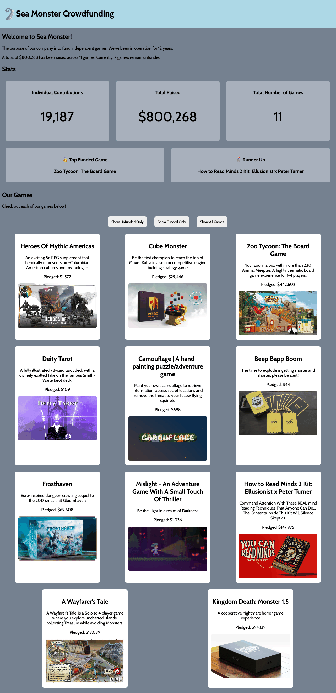

# WEB102 Prework - Sea Monster Crowdfunding

Submitted by: **Emilio Shahib**

**Sea Monster Crowdfunding** is a website for the company Sea Monster Crowdfunding that displays information about the games they have funded.

Time spent: **8** hours spent in total

## Required Features

The following **required** functionality is completed:

* [x] The introduction section explains the background of the company and how many games remain unfunded.
* [x] The Stats section includes information about the total contributions and dollars raised as well as the top two most funded games.
* [x] The Our Games section initially displays all games funded by Sea Monster Crowdfunding
* [x] The Our Games section has three buttons that allow the user to display only unfunded games, only funded games, or all games.

The following **optional** features are implemented:

* [ ] List anything else that you can get done to improve the app functionality!

## Video Walkthrough

Here's a walkthrough of implemented features:

GIF created with Playwright screen capture (see `scripts/generate_walkthrough.py` to regenerate).

## Notes

The main challenge was keeping the correct project folder for submission: a duplicate `web102_prework` copy had incomplete `index.js` (challenges 4–7 missing). The completed code lives at the repository root. Filtering buttons, stats, company summary, and top-funded games are implemented in `index.js`.

## License

    Copyright [yyyy] [name of copyright owner]

    Licensed under the Apache License, Version 2.0 (the "License");
    you may not use this file except in compliance with the License.
    You may obtain a copy of the License at

        http://www.apache.org/licenses/LICENSE-2.0

    Unless required by applicable law or agreed to in writing, software
    distributed under the License is distributed on an "AS IS" BASIS,
    WITHOUT WARRANTIES OR CONDITIONS OF ANY KIND, either express or implied.
    See the License for the specific language governing permissions and
    limitations under the License.
